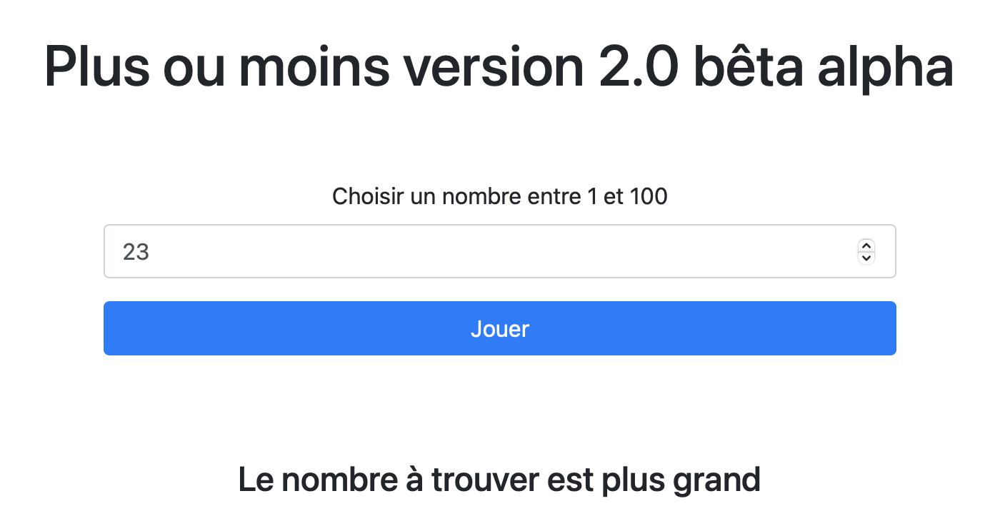

# Plus ou moins le jeu

Un visiteur propose un nombre ou un chiffre depuis un formulaire entre 1 et 100. L'ordinateur guidera le joueur en lui indiquant si le nombre à trouver est plus grand ou plus petit que son choix.

## Langages utilisés
HTML, CSS (SASS) et JavaScript

## Détails
Une page HTML contenant un formulaire composé d'un champ texte et d'un bouton.  
À chaque validation du formulaire, vérifier que le nombre envoyé est plus grand ou plus petit que celui choisi par l'ordinateur et indiquer au joueur "Votre nombre est trop grand" ou "Votre nombre est trop petit".

Le tout sur la page HTML où se situe le formulaire.

## Bonus
Possibilités d'ajouter une variante en ajoutant un certains nombres d'essais au jeu.

## Bonus 2
Possibilités de garder un historique des nombres joués affichés sous le formulaire.

# Preview

